# Creating a DLC auto-scaling solution
One of the advantages of using DLC is that during an outage of its downstream QRadar, it will buffer incoming events and patiently wait for QRadar to return. This works very well with the solution described in [data_sync_automation](https://github.com/ibm-security-intelligence/aws_qradar_availability/tree/main/data_sync_automation) due to the brief outage that happens during QRadar DataSync failover. DLC's buffering will ensure that data is only delayed and not lost.

However, this means that we're dependant upon the resiliency of DLC to maintain data flow. If the DLC should fail or if a datacenter or availability zone outage takes it out, then we could lose data or suffer an extended outage. The solution here is to setup AWS autoscaling to ensure that a DLC will be recovered/replaced automatically if it fails.

## The simple version
Let's start with a single-instance DLC autoscaling solution. In this use case our autoscaling group will have only a single DLC. If a failure is detected then that single instance will be replaced. The DLC wasn't really designed to run in a cluster so maintaining single-instance keeps things simple. This procedure can be repeated to provide multiple resilient DLC instances. Multi-instance autoscaling groups will come later.

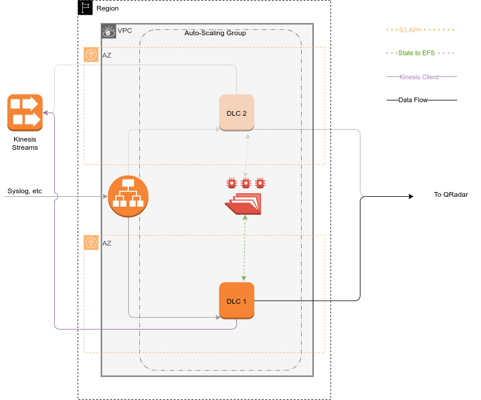

In the above example, we have an initial DLC setup in one availability zone and added to an auto-scaling group where only one instance is running. If there is a major failure in the first AZ, autoscaling will create a new instance in the second AZ.
### Create a DLC instance
Begin by installing a DLC instance on an EC2 instance normally, following the DLC Guide. This should include all the steps required for enabling TLS communication with QRadar. Be sure to confirm that DLC connection and authentication is working fully before proceeding.

### Create and mount an EFS filesystem
Second, set up and EFS filesystem in the same VPC as the DLC instance. This will be used to hold the DLC's state and things like log source configuration that will have to change over time. Follow the AWS guidance [here](https://aws.amazon.com/efs/getting-started/) or [here](https://aws.amazon.com/getting-started/tutorials/create-network-file-system/) to create the EFS filesystem. Once it is up an working, mount this filesystem in the DLC instance at the /mnt path. e.g:
```
mount -t nfs4 -o nfsvers=4.1,rsize=1048576,wsize=1048576,hard,timeo=600,retrans=2 fs-XXXXXXXX.efs.REGION.amazonaws.com:/ /mnt
```

Also add the above to the end of /etc/fstab so that it will survive a reboot. e.g:
```
fs-XXXXXXXX.efs.REGION.amazonaws.com:/	/mnt	nfs4	nfsvers=4.1,rsize=1048576,wsize=1048576,hard,timeo=600,retrans=2	0	0
```

Now that we have the external storage available, we can move the DLC's stored data and config with the `migrate_to_nfs.sh` script. This scipt is invoked without parameters and will create a subdirectory on the nfs mount using the UUID of the DLC and within that copy config.json, logSources.json and /store. It will then symlink these to their original locations. Doing this means that even if the DLC goes down, any currently buffered data will still be available to a replacement DLC and data loss will be near zero (depending on the collection protocols used). Also, by placing the config.json file on the NFS mount, all configuration updates (i.e. log source configurations) will also survive the failure of the DLC.

### Setup autoscaling for the DLC
This is done in three of stages. The first is simple: create an image from the DLC instance configured above. The second is to create a launch configuration using that image so that copies can be automtatically started with the correct EC2 types and so on. Finally, create an auto-scaling group with "Desired capacity", "Minimum capacity" and "Maximum capacity" all set to 1. This scaling group will ensure that there is always one instance of our DLC running in an availability zone.

#### Create the image
From the list of instances, select the DLC instance created above and from the Actions menu select "images and templates" and then "Create image". Give the image a meaningful name, make sure the volume settings are correct and optionally add a name tag to help distinguish it from other images.
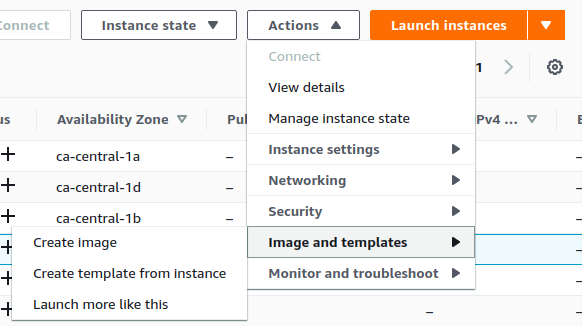
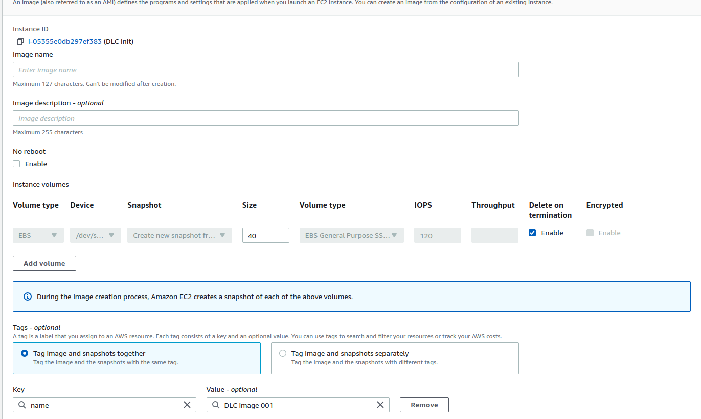

#### Create a launch configuration
From the EC2 sidebar, select Launch Configurations from the AUTO SCALING section and Create launch configuration. Choose a meaningful name, assuming you may create multiple DLC launch configurations over time.
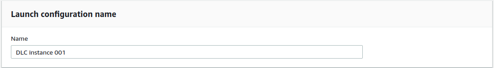

Choose the AMI image you just created. It will appear under 'My AMIs' and choose an instance type (likely similar to the original one). 
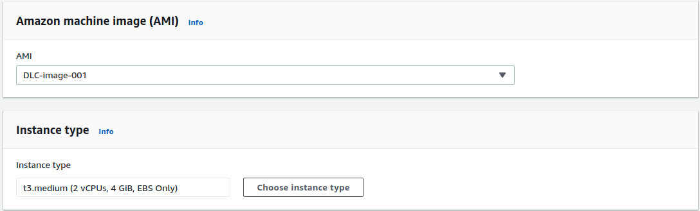

Be sure to choose a Security Group appropriate for DLC event collection, this will likely be the same existing one that was used to set up the initial instance above.  Also choose a key pair for SSH that will allow administrators access for support and trouble-shooting.
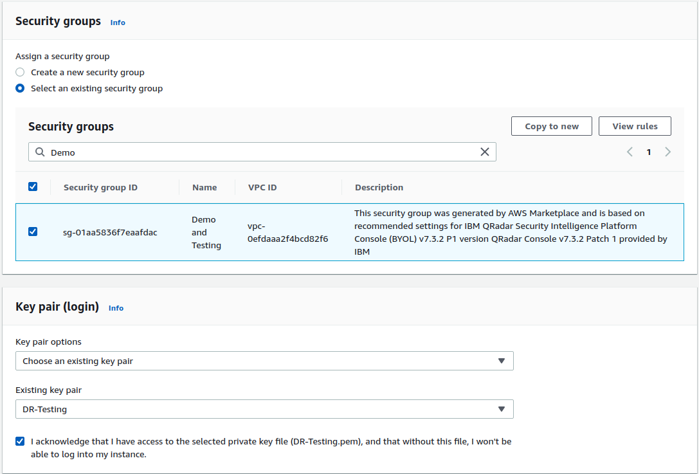

#### Create an auto-scaling group
From the EC2 sidebar, select Auto Scaling Groups and "Create an Auto Scaling group". Once again, choose a meaningful name then "switch to launch configuration" and choose the configuration we just created. Click Next.
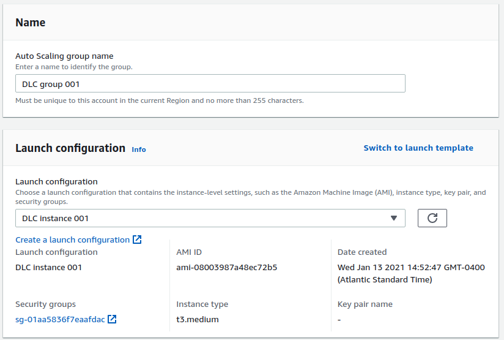

Choose the correct VPC for the DLC to run in and select a set of subnets that span availability zones. By selecting multiple subnets, each in different zones we allow the Auto Scaling to choose from alternatives when one zone has a failure which is the point of the exercise. Click Next.
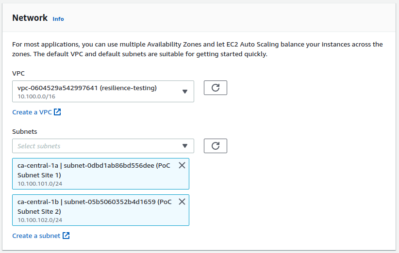

You can leave all the advanced options as-is. If, at a later time, you determine that you need a load balancer or more frequent health checks you can create another auto-scaling group. Click Next.

Group size should remain at the defaults (all capacities set to 1). Click Next.
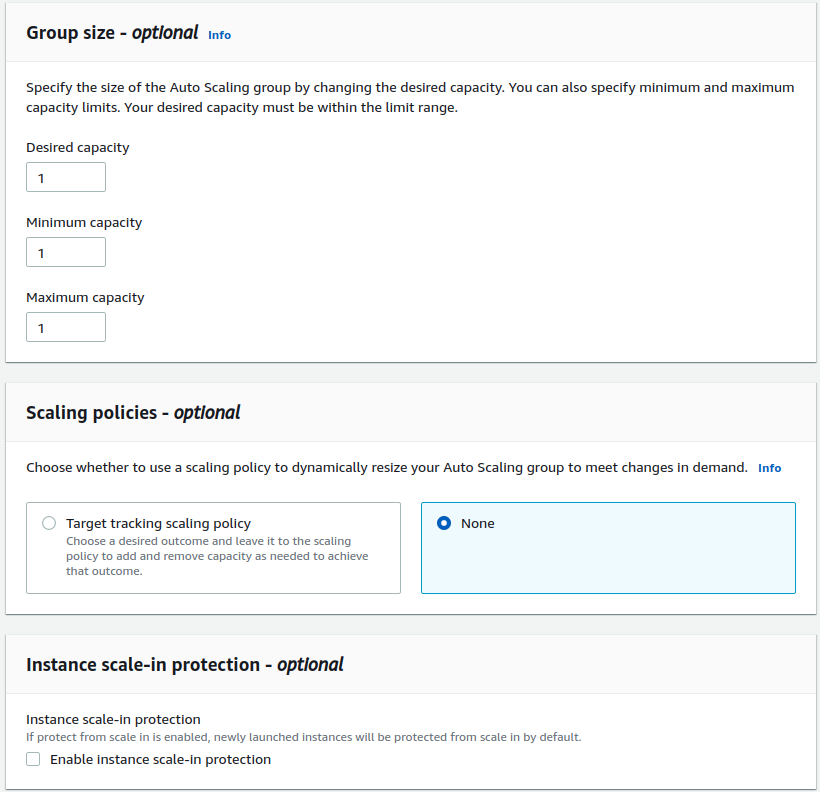

Notifications are optional but recommended in production. Click next.
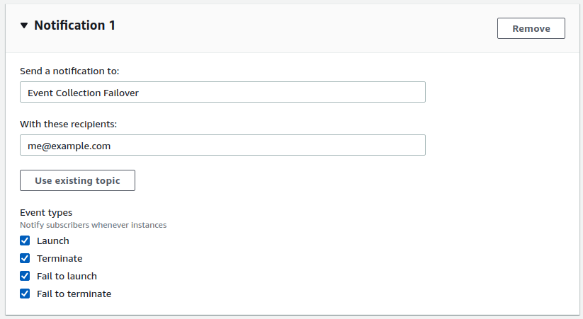

Adding a name tag is a good idea so that the auto-scaled instances can be identified in a list of EC2 instances. Click Next, review the settings and create the group. 
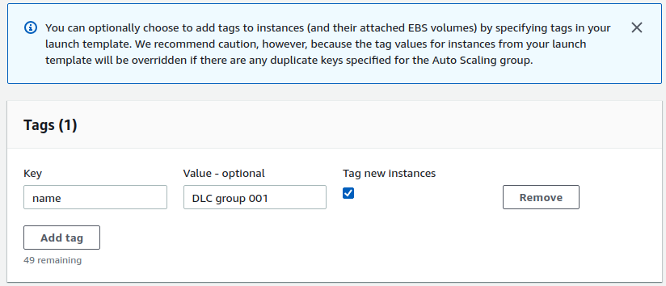

Within a few minutes the auto scaling will start up the inital instance. You can test the auto-scaling by shutting down or terminating that instance and see that it will be replaced within minutes.

